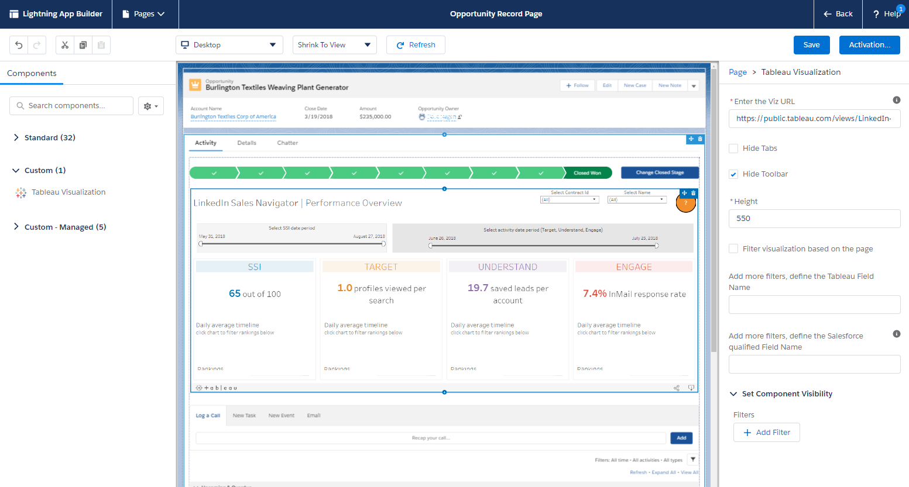

# Lightning Web Component for embedding Tableau into Salesforce

[](https://github.com/tableau/tableau-viz-lwc/actions)

___

#### *Developer Preview*
___

This project provides a Lightning Web Component that you can customize and use to embed Tableau into Salesforce. This component uses the [Tableau JavaScript API](https://help.tableau.com/current/api/js_api/en-us/JavaScriptAPI/js_api.htm) for embedding Tableau into web pages.

> This sample component is designed to run on the Salesforce Platform.

## Table of contents

- [Install the component using a Scratch Org](#install-the-component-using-a-scratch-org): This is the recommended installation option. Use this option if you are a developer who wants to experience the component and the code.

- [Install the component using a Developer Edition Org or a Trailhead Playground](#install-the-component-using-a-developer-edition-org-or-a-trailhead-playground): Useful when tackling Trailhead Badges or if you want the component deployed to a more permanent environment than a Scratch org.

- [Add the Tableau Visualization component to an App](#add-the-tableau-visualization-component-to-an-app): After you have installed the component on your org, you can add a Tableau viz to an App in Salesforce.  

- [Sign up for the LWC test scenarios on the Tableau Developer Program Portal](#sign-up-for-the-LWC-test-scenarios-on-the-tableau-developer-program-portal):  Join the Developer Program and gain access to the private Tableau LWC test scenarios.

- [Troubleshooting problems deploying the LWC for Tableau](#troubleshooting-problems-deploying-the-lwc-for-Tableau): Solve issues related to deploying the Lightning Web Component for Tableau to your scratch org or Trailhead Playground.

____

## Install the component using a Scratch Org

1. Set up your environment. Follow the steps in the [Quick Start: Lightning Web Components](https://trailhead.salesforce.com/content/learn/projects/quick-start-lightning-web-components/) Trailhead project. The steps include:

    - Enable Dev Hub in your Trailhead Playground (*Important*)
    - Install Salesforce CLI
    - Install Visual Studio Code
    - Install the Visual Studio Code Salesforce extensions, including the Lightning Web Components extension

---

   > Note that you will use the Salesforce CLI to perform the following steps. Be sure you enable Dev Hub in your Trailhead Playground before you begin. Login to your Playground. Go to **Setup > Development > Dev Hub**).

___

1. If you haven't already done so, open a Command window and authorize your hub org and provide it with an alias (**myhuborg** in the following command):

    ```
    sfdx force:auth:web:login -d -a myhuborg

    ```

1. Clone the **tableau-viz-lwc** repository:

    ```
    git clone https://github.com/tableau/tableau-viz-lwc

    ```

1. Navigate to the directory of the repository you just cloned.

   ```
   cd tableau-viz-lwc

   ```

1. Create a scratch org and provide it with an alias (**tableau-viz-lwc** in the command below):

    ```
    sfdx force:org:create -s -f config/project-scratch-def.json -a tableau-viz-lwc

    ```

1. Push the component to your scratch org:

    ```
    sfdx force:source:push
    ```

1. Open the scratch org:

    ```
    sfdx force:org:open

    ```

    This opens Salesforce and takes you to the scratch org.

1. Now you can [Add the Tableau Visualization component to an App](#add-the-tableau-visualization-component-to-an-app).

___

## Install the component using a Developer Edition Org or a Trailhead Playground

Follow this set of instructions if you want to deploy the component to a more permanent environment than a Scratch org.
This includes non source-tracked orgs such as a [free Developer Edition Org](https://developer.salesforce.com/signup) or a [Trailhead Playground](https://trailhead.salesforce.com/).


1. Authorize your Trailhead Playground or Developer org and provide it with an alias (**mydevorg** in the following command):

    ```
    sfdx force:auth:web:login -d -a mydevorg
    ```

1. Clone this repository:

    ```
    git clone https://github.com/tableau/tableau-viz-lwc

    ```

1. Navigate to the directory of the repository you just cloned.

   ```
   cd tableau-viz-lwc

   ```

1. If you are setting up a Developer Edition: go to **Setup**, under **My Domain**, [register a My Domain](https://help.salesforce.com/articleView?id=domain_name_setup.htm&type=5).

1. Run this command in a terminal to deploy the component.

    ```
    sfdx force:source:deploy -p force-app
    ```
    If see an error message that asks you to specify a username or OAuth options, use the following command and replace `username` with the login name you use for `mydevorg`.

    ```
    sfdx force:source:deploy -p force-app -u username
    ```

1. If your org isn't already open, open it now:

    ```
    sfdx force:org:open -u mydevorg
    ```

    This opens Salesforce and takes you to your Developer Edition Org or Trailhead Playground.

1. Now you can [Add the Tableau Visualization component to an App](#add-the-tableau-visualization-component-to-an-app).


___

## Add the Tableau Visualization component to an App

After you have successfully deployed or pushed the `tableau-viz-lwc` component to your scratch org, Developer Edition Hub, or Trailhead Playground, you can use the component to add a Tableau viz to your App.

1. From the App Launcher (), find and select **Sales** (or any other App that provides page where you can embed the Tableau Lightning Web Component).

1. Click the Setup gear () then select **Edit Page**.

1. Drag the **Tableau Visualization** component from the Custom area of the Lightning Components list to the top of the Page Canvas.

1. Select a Tableau viz to display by providing the URL for the viz in the **Enter the Viz URL** text box.

   To find the URL for a viz on Tableau Server or Tableau Online, click **Share** on the toolbar and select **Copy Link** from the Share View dialog box. For Tableau Public, copy the URL for the viz from the address bar in your browser.

   In Salesforce, use the options for the **Tableau Visualization** component to control the size of the viz and whether you want to show the Tableau toolbar or any tabs for the viz.
  
> For this first release, we support SSO only with SAML. If you want to configure Tableau to use Salesforce IdP, follow the steps described in [Configure SAML with Salesforce](https://help.tableau.com/current/online/en-us/saml_config_salesforce.htm).





___ 

## Sign up for the LWC test scenarios on the Tableau Developer Program Portal

We want to hear from you!


Join the Developer Program and gain access to the Tableau LWC test scenarios on the Developer Program Portal.

If you don't already have access, send email to [tableaulwcprerelease@tableau.com]( mailto:tableaulwcprerelease@tableau.com?subject=Tableau%20LWC%20Pre-Release) with **Tableau LWC Pre-Release** on the subject line.


To get to the scenarios, go to the Tableau Pre-Release site (https://prerelease.tableau.com/) and to the Developer Program Portal. Under **Tasks**, look for the **Tableau Lightning Web Component Alpha**.

- Complete the Tableau LWC test scenarios
- Send us your feedback
- Report any bugs you find
- Request new features
- Ask questions of the Development Team

Welcome to the **#DataDev** Community!
___

## Troubleshooting problems deploying the LWC for Tableau

- **Tip:** Be sure to run the `sfdx` commands from within the project folder.

- If you encounter the following error message when trying to create a scratch org:

   `ERROR running force:org:create:  You do not have access to the [ScratchOrgInfo] object`

   If you have not already done so, you might need to enable Dev Hub in your org. Login to your org and go to **Setup > Development > Dev Hub**). Or search for "Dev Hub" in the Quick Find text box.

- If you encounter the following message when trying to deploy the component:

  `ERROR running force:source:deploy:  Must pass a username and/or OAuth options when creating an AuthInfo instance.`

  Use the `-u username` option. To determine the `username` for your Salesforce org, you can use the command `sfdx force:org:list` to display information about the orgs you have created or are connected to.

> For more information about fixing problems with deployment, see [Troubleshoot Salesforce DX](https://developer.salesforce.com/docs/atlas.en-us.sfdx_dev.meta/sfdx_dev/sfdx_dev_troubleshoot.htm) in the [Salesforce DX Developer Guide](https://developer.salesforce.com/docs/atlas.en-us.sfdx_dev.meta/sfdx_dev/sfdx_dev_intro.htm).